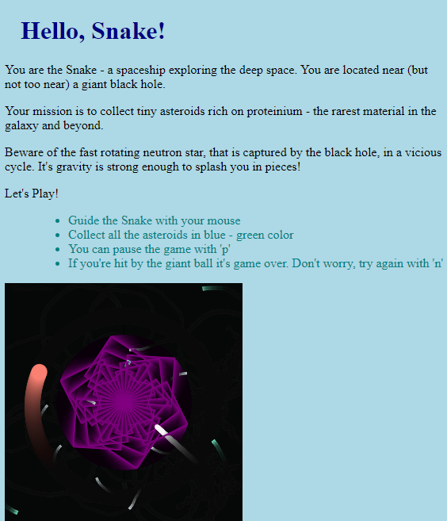

# xgame-js

A simple game to play with graphics in vanilla JS using canvas. It extends the idea of a simple "turtle" moving around the board
and drawing with "a pen". Adds some gameplay dynamics, event listeners, effects and collision detection.

## Preview

## Credits:

* https://developer.mozilla.org/en-US/docs/Web/API/Canvas_API/Tutorial
* https://developer.mozilla.org/en-US/docs/Games/Tutorials/2D_Breakout_game_pure_JavaScript
* https://github.com/toolness/tiny-turtle

## Resources:

* https://htmlcolorcodes.com/color-names/
